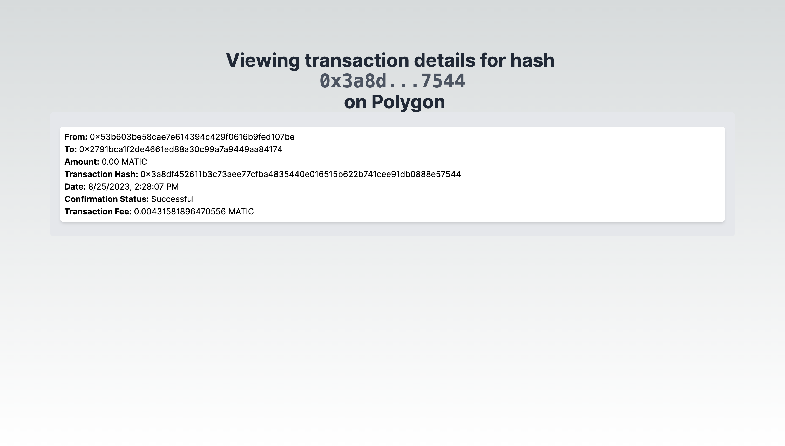

# EVM Blockchain Explorer

A simple blockchain explorer where you can see the latest transactions for a given address and dive deeper into transactions of interest and see more details about them. This works for both Ethereum and Polygon addresses and was heavily inspired by Etherscan.

The website is hosted on Vercel, feel free to visit the website here: https://frontend-blockchain-assessment.vercel.app/


<pre></pre>


<pre></pre>



## Routes

### /address/[address]

Example: `/address/0x53b603BE58cae7e614394c429f0616b9Fed107Be`

Here you can see the last 100 transactions performed by this address.

### /transactionDetails/[transactionHash]

Example: `/transactionDetails/0x539443f3337f1d5521f514bb4d27e9b9ef28826a89b0c8fc28be8a53e5a7a6bc`

Here you can see a variety of details on this transaction.

## Getting Started for Developers

To get started set up the following 2 variables in your .env file:

`NEXT_PUBLIC_ETHERSCAN_API_KEY` and `NEXT_PUBLIC_POLYGONSCAN_API_KEY`

```bash
npm run dev
```

Open [http://localhost:3000](http://localhost:3000) with your browser to see the result.
